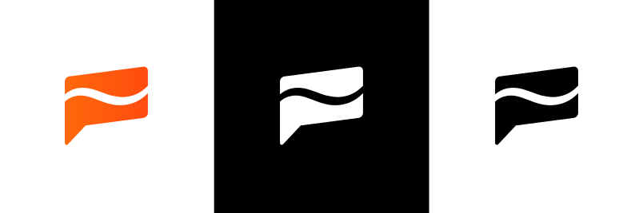

# Flame is on a mission 

Flame Software VOF is a Dutch registered company founded in 2022 by two Computer Engineering students with the vision to revolutionize online communications.

We believe the open mindset of technologies like Email, IRC and RSS need a return. They shaped the internet, and made it a world of the free. But big tech like Discord, Google and Facebook are privatising our beautiful world-wide network of human communication, forcing their hand on what you're allowed to do.

We dream of an internet where people have the freedom to make their own independent decisions without the risk of losing their ability to contact everyone who is important to them. An internet where you have the control to make it *your* internet.

---

# Where to start 

Interested in our mission? <a href="/v0.1/company/whitepaper">Read our Whitepaper</a> containing our solution and plan on how we will carry it out. You can also come and <a href="https://discord.gg/Z6qcNckczz">join our Discord server</a> where you will be notified of updates.

---

# **Meet Flame's Team** 

## Pascal van Ginkel, Head of Technology
#### Discord: Mid#0001 - Twitter: @midblep

Hey I'm Mid, Head of Technology at Flame. That means I am concerned with the technical structure of Flame Software and its products such as server architecture, tech stack, code conventions, pull requests, code reviews, protocol development, documentation, and developing Flame's codebases. I have nearly a decade of experience with web development and 4+ years of experience with chat-app related development.

## Thom Sandbrink, Head of Operations
#### Discord: Thommunist#7823 - Twitter: @thommunist

My main tasks are the daily operations of Flame Software such as keeping an organised company structure with tools, planning and overseeing important company tasks, management of social media accounts, overseeing Flame's public appearance and client relations, and making sure documentation and reports about the company are in order. I will also work on Flame's code repositories and contribute code.

---

# **Social Info** 

[💻 Website](https://flamesoftware.net/)
[📄 Blog](https://flamesoftware.net/blog)
[🐦 Twitter](https://twitter.com/FlameCommsApp)
[🐙 Github](https://github.com/flame-software)
[📖 Facebook](https://facebook.com/profile.php?id=100086464458848)
[🖼️ Instagram](https://instagram.com/flamesoftware)
[👪 Discord](https://discord.gg/Z6qcNckczz)

