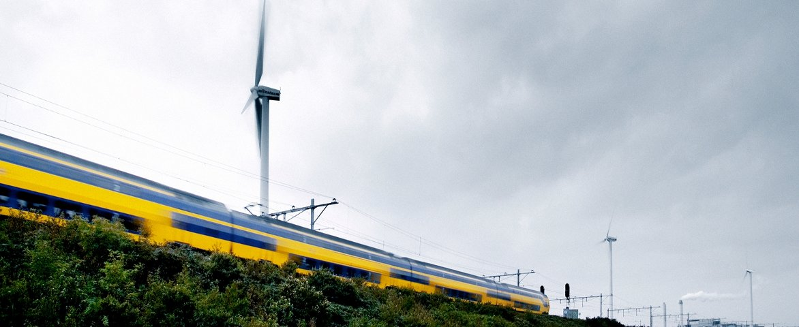

# What is the problem? 
In the modern world, we have many differences, but we can all agree on 1 thing. Climate change is happening, and we need to do something. We need to take care of our little planet before it is too late. Flame wants to take care of the environment by reducing our pollution to 0%. But how can we achieve this, I can hear you thinking. That's where this little article comes in. What can we, as Flame, do for our planet?

Before we van do something about the problem, we need to know it. So what's the problem for the planet with Flame? The problem is that when Flame grows, our electricity consumption will grow. "In 2016, it was reported that the world’s data centers used more than Britain’s total electricity consumption - 416.2 terawatt hours, significantly higher than the UK’s 300 terawatt hours." <a href="https://www.computerworld.com/article/3431148/why-data-centres-are-the-new-frontier-in-the-fight-against-climate-change.html">Charlotte Trueman, Computerworld</a>.

 

 

So the problem is that the data center's energy consumption has only grown since 2016. What can we do about this issue? As Flame, we can be so energy efficient as possible. But it is unavoidable that we will use electricity. What we van do is use renewable energy. I won't go too deep in the concept of renewable energy, but the concept is that renewable energy is green energy. This means that it does not come from fossil fuel, like oil (gray energy). Renewable energy is a never ending source of energy like sunlight, water and wind. If you want to learn more about renewable energy, check out this page from the UN:  <a href="https://www.un.org/en/climatechange/raising-ambition/renewable-energy">United Nations, renewable energy</a>

 

# Flame's policy and promise 
We as Flame can make an impact by use only renewable energy. Our server is only powered by solar panels, so the server is 100% powered by renewable energy. Beside that our server, our computers are also powered by 100% renewable energy. This means that we can develop Flame and host Flame with pure green energy and zero gray energy.
Besides our computer's and server, the founders of Flame travel by bike, electric vehicle's or with an electric train. In the Netherlands, trains run on 100% green energy. <a href="https://www.ns.nl/en/about-ns/sustainability/climate-neutral/green-energy-for-train-bus-and-station.html">NS sustainability.</a> So when we go to college or go to a customer for a meaning, we do not emit carbon dioxide.

We can promise our supporters that we will stay a 100% carbon dioxide neutral company and will do our best to save the planet. We want to connect the world with Flame, and we believe that it will help to save earth against climate change.

 

# Motivating third parties 
We can't achieve our goal alone. We need a lot of people to cooperate with us. So we want to motivate people and companies that are working with us to do the same. Take a bike or train to work or school. Trow your waste into the bin and not on the street. All the little things count up. Together, we can make the world a better place!

There is only one last thing to ask you:

🔥 Will you spread the Flame 🔥

