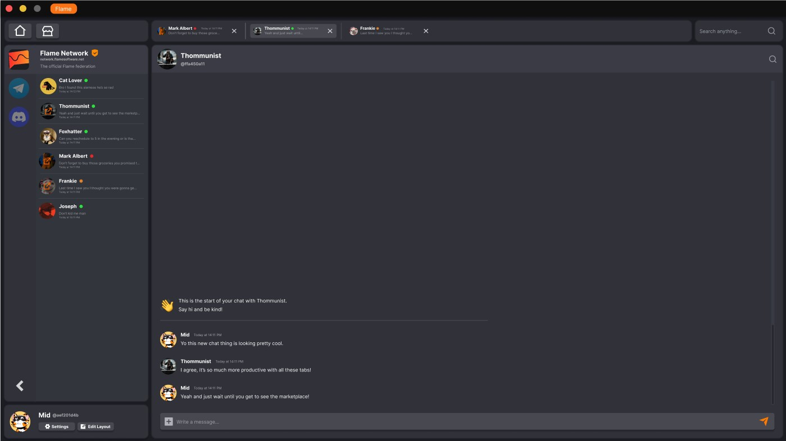
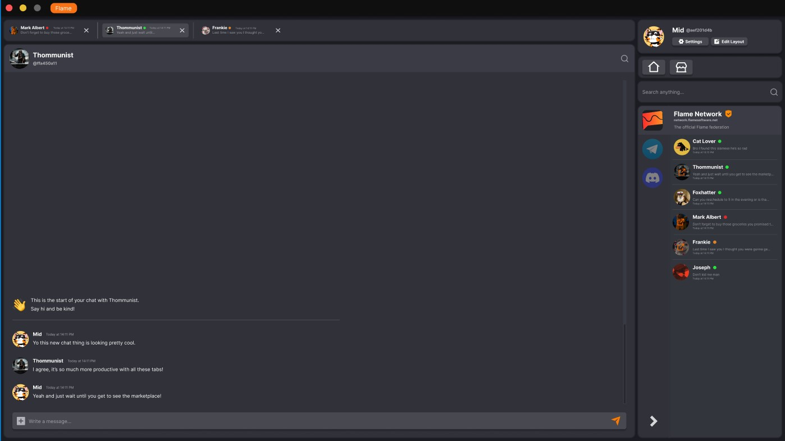
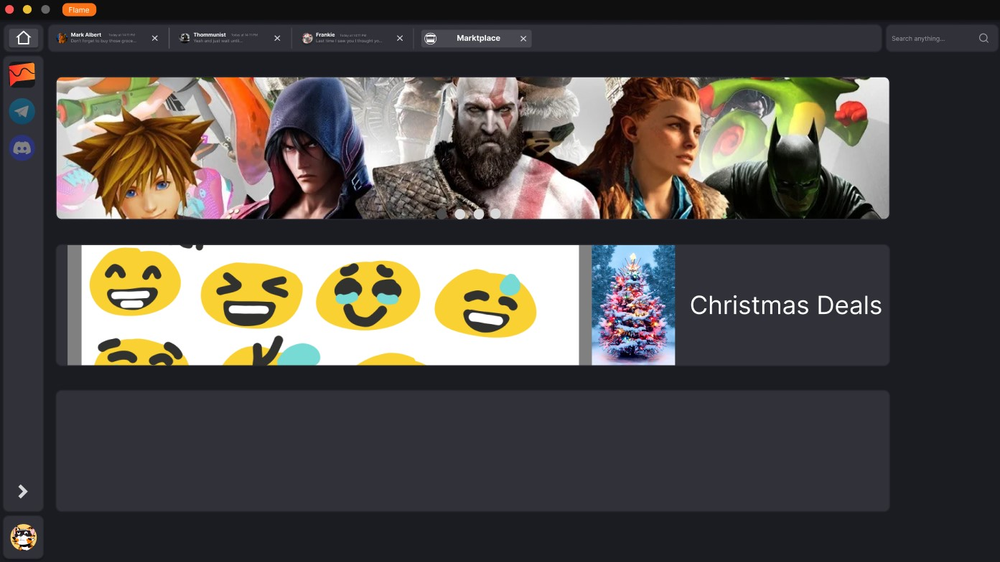

## Competitors  

In this table we have discovert our competitors. Each competitor has it's own strenght and weakness. We can learn from both as Flame.

|     Name    |     Why                                           |     What are they offering                                          |     Active user base              |     Can we learn from them                                                                                    |     Seperate                                                        |
|------------------------|------------------------------------------------------|-------------------------------------------------------|-----------------------------------|---------------------------------------------------------------------------------------------------------------|----------------------------------------------------------------------------------|
|     Telegram           |    Big Chat platform                            |     Alternitive for Whatssapp with more features       |     500.000.000                   |     Users want privacy                                                                             |     More privacy and no phone number needed                            |
|     Discord            |     Relevent   featureset and markt category       |     Online   communities + gaming                     |     150.000.000                   |     Users want to pay for looks of their account                                           |     Server   on platform                                                    |
|     Meta               |     WhatsApp +   Messenger + Instagram + Facebook    |     Standard internet communication  |     +2.000.000.000                |     Traditional chat app. Users use it because their friends use it    |     Many users and easy to use    |

## Why is Flame different  

Flame is diffent from our competitors because we focus on an customisable platform that a user can form to his own will. Also every other chat platform can be integrated in Flame. So if you want to switch to Flame because it is awesome but your friends are not that awesome, no problem! You can chat with them on Whatssapp from Flame.

## Flame as a product 

The future product of Flame Software will be an chat platform.
Because Flame is an chat platform it is hard to discribe. That is why we make a weekly mockup of how Flame could look like. Here are some examples:

