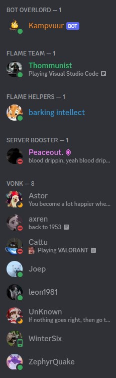
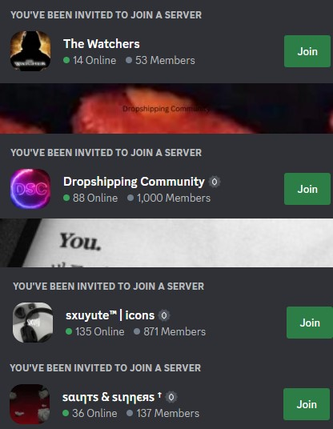

## Team  

The team of Flame currently excist out of 2 people. We will tell you something about our selfs:
- Hello, my name is Thom and I'am Head of Operations at Flame Software.
My main tasks are the daily operations of Flame Software such as keeping an organised company structure.

- Hey I'm Mid, I am an equal share director with Thom and founded the concept of Flame. I am mainly concerned with the technical structure of Flame Software.

## Tasks  

We are botch software engineers who are gonna devolep the Flame application. If we need any help we want to ask it to the community. In our community are many different kinds of people with their own skills. So if we want help of some one then we can ask it to them. We want no employees who needs to get paid, because we can't afford that at the moment and we believe that we can build the application by our selfs, with the help of our community.

## Partners  

We do not have partners yet for our compagny. But in Discord we have partnering servers. Partnering servers are servers that promote you with their own members. Right to this text is a list of some of our partners.

