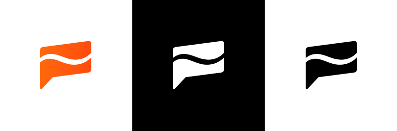
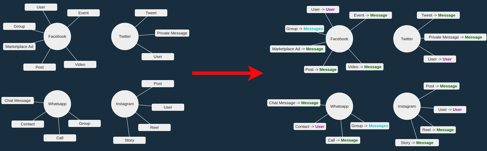
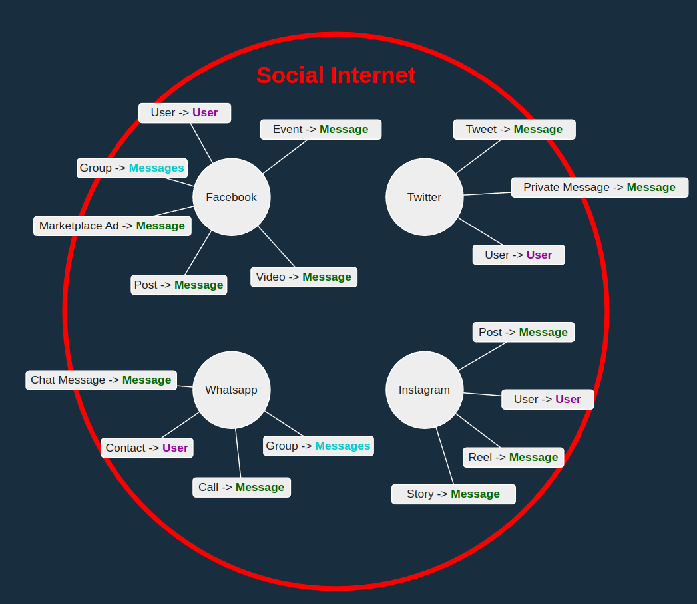
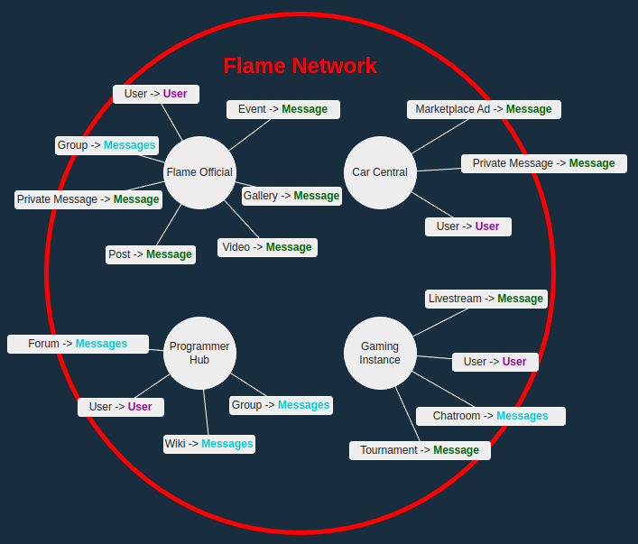
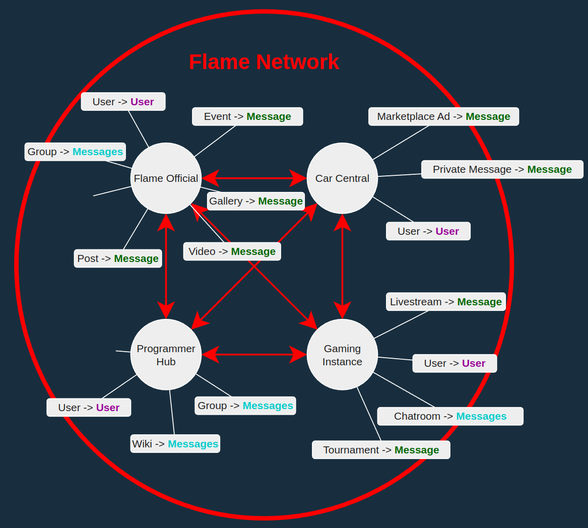
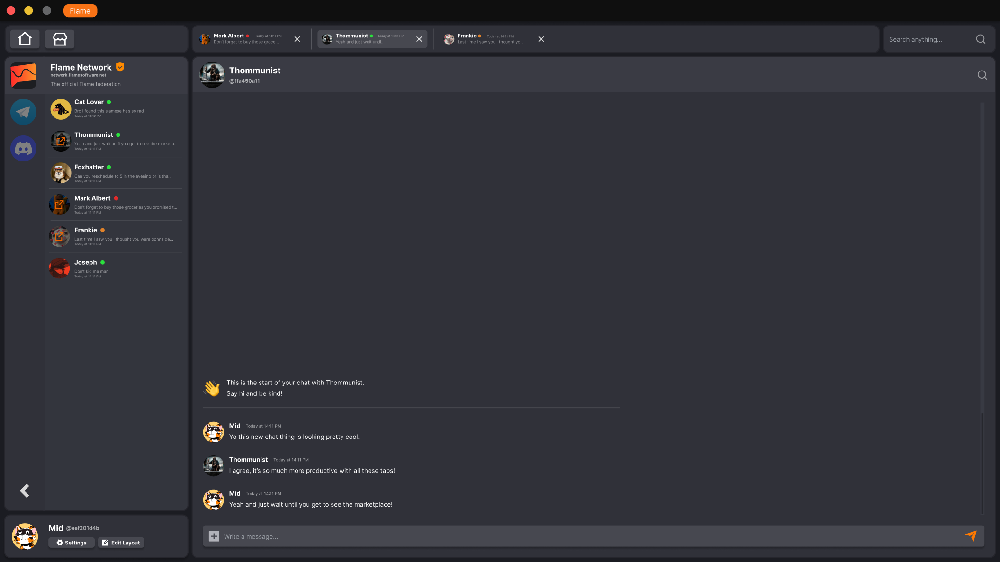

```js
NOTE FOR PUBLIC READERS:
! This pitchdeck was made as part of the Minor our founders contribute in.
! It is a slim version of our Whitepaper which will release soon.
```

## Introduction <a name="{sections[0]}"></a>

Flame Software is a company built by two IT students. We grew up around the internet and are invested in it and its health.

But as we used it to create friendships and have fun, we found ourselves increasingly frustrated with how there's always a new place we need accounts for, and that each one just didn't feel like quite what we wanted.
We realized the internet was originally meant for computers to talk, not people, and that it needs a way to sustainably support the communication of people worldwide that actually works.

That is why Flame Software wants to create a product that understands the different needs of everyone, where you can create your own rules in a network that is shared, open and fair.
Our vision is for our new and open network to become the new standard of how people communicate online.



---

# Who are our customers <a name="{sections[1]}"></a>

Our customer segment exists primarily of internet geeks, power users, gamers, content creators and similar.
They are the kind of people who build their lives online, who make friendships and create content.
The people who are invested in what they do and want it to be just the right way for them.

Because of how dynamic our market is we do not have exact numbers but we believe this market segment is large for which we have several reasons.

One of our closest competitors, Discord, has over 350 million users. That is comparable to more mainstream platforms like Twitter.
We believe this is because this more internet-focused segment spreads beyond some type of person and instead contains people from any region, race and religion.
Another close competitor is a niche platform called Mastodon, a platform like Twitter that is decentralized with a structure similar to that of Flame, which has reportedly grown rapidly in the last few months to 2,5 million users following unrest related to Elon Musk's acquisition of Twitter.

This shows that people are getting increasingly upset with traditional socials and looking for a way to untie themselves from any one company, which only grows our potential userbase.

But Flame has potential to spread way further than our intended initial market segment. We believe the way Flame connects and lets you customize will be very useful in the future for other segments like:
- Businesses and enterprises
- Education
- Students

---

# The problem <a name="{sections[2]}"></a>

The below diagram on the left displays in a simplified way how the internet is current laid out.
Various sites that humans use to connect with use various different methods to get information across.
You have things like basic Tweets that convey a generic piece of information, or a more specialized type of content like a Marketplace Ad that is meant to advertise a product.

Now look at the below diagram on the right. It is all of the same things but called what they really are underneath. You can see there's pretty much just two things: A user and a message (or multiple messages together).
A message is any piece of information sent from one person to another. That information doesn't have to be text though, it can also be an image, a video, a voice call or anything else.
Social medias just add a bunch of sugar on top of these messages to make it simple for you to use and call it things like a Tweet, a Post, a Gallery, a Group, etc





<br/>

All of these sites are accessible from the internet, and all of these social apps and websites together make up the social part of it. This corner of the internet we use to talk to each other.

But there's a number of problems with this, and opportunities to solve it.

What if you wanted something else than what is currently around? Maybe you just feel like Marketplace Ads don't fit your needs, or you think that the text limit on a Whatsapp message is too short.
Well you're tough out of luck. Your best bet is to go and start your own brand new social site. But then you don't have the billions of users already present, and have to convince people to join *yet another one*.

Some of these people go on and do actually make a new platform, but that usually results in fragmenting the online world even more. Solving one problem while creating another. More places to be, none of them properly connected.

Power users, gamers, and tech junkies who value the internet and the friendships they have made often face these kind of problems. They want more control over how they lay out their lives online. That is where we step in.

<br/>

---

# The solution <a name="{sections[3]}"></a>

Flame's platform is made from the ground up to allow users as much freedom as possible. Let's explore how it works.

We realized social sites have a lot in common. All of them convey information under the hood through messages. So how can we allow this to be more free?
By letting people create their own types of messages and add the aforementioned sugar on top of it however they like. This allows users to create their own rules.
What does the message look like? How many of them can you make? Does the message have a gallery of pictures? Or does it have a price? Maybe it can be edited by others, like an article? Maybe it's only visible to you, or everyone? All things the user may decide.

The diagram below displays what Flame's platform would look like.
People create their own areas and rules, similar to the Facebooks and Instagrams of the earlier examples.

A car focused place has things to sell and buy like Marketplaces. A place for gamers will have chatrooms and tournaments specifically for games. Programmers might want forums to discuss and wikis to share information. And a generic place like Flame Official might want a bunch of everything at once.

While giving people the power to make their own rules is cool, it still creates divide. For example: People can join Car Central and be left dissatisfied. Then they make their own place, let's call it Car Empire. But now, nobody is using Car Empire and they still have to convince people to make *yet another account*. This problem of not being connected will be solved by Flame too.



In the previous diagram we can see everything still translates back into simple messages. Because everyone is part of the network and because things so similar, we can actually connect these places!

This kind of network opens up a lot of more advanced future possibilities such as:
- Giving people insight into their online life in one place
- Allowing people to choose what places they trust with their data
- Letting people join or leave new things that innovate without needing new accounts, similar to how TikTok innovated on the video format

And it is why we believe a connected network under a common understanding like this is the best way to make the internet friendlier for humans to communicate.



---

# How far are we? <a name="{sections[4]}"></a>

Early on we realized how important it is to get this right the first time. Because developing an ambitious project like this takes months if not years to fully realize, we must plan ahead.
That is why we spent the past few months researching and validating our work and gathering a potential early community of people that share our vision and want to help us out.

We have done this by making mockup designs, sharing information with our community about certain ideas, doing surveys and conducting interviews about our profit model and plans.

We have also reached out to creators and influencers in our market to partner up and see how they can help promote our product.

<span class="links">

[Conducted Survey](https://surveys.flamesoftware.net)
[Blogposts](https://flamesoftware.net/blog)
[Discord Community](https://discord.gg/Z6qcNckczz)

</span>



## Phases

### Phase 1: (current, under 1 year)

Building and constantly refining the idea, the standard and the plans through continuous feedback from the community we're building.
At the end of this phase we'll have a Minimal Viable Product to show to beta users that incorporates the basic principles of our vision.
Our profit model exists out of supporting users who believe in our mission and buy a monthly subscription for some basic extra features and a thank you.

### Phase 2: (mid-term, 1 to 2 years)

Phase 2 expands on our Minimal Viable Product and adds the marketplace, our primary source of monetization.
It also adds more features and completes the value of the network as more users join it.

### Phase 3: (long-term, 2 to 5 years)

Here our product is finished and more and more users are using it. The amount of users and the ease of customisation attracts larger entities like companies who want a piece of the pie.
We further diversify our revenue stream by adding another monetization business by renting a place on the network and manage and customise it for them against a monthly cost.

---

# Profit model <a name="{sections[5]}"></a>

## Premium

The short-term goal is to break-even on a subscription model which will allow the user extra cosmetic features at a small monthly price. (between 5 and 10 euros / month)
This is not our end goal and exists for our core community to support us while we are building the product.

## Marketplace

Think about places like the App Store or Facebook Marketplace, online places where people can buy and sell for money or for free.
Usually a cut goes to the platform, in the App Store's case up to 30%, and that is how the platform earns money.
Flame will build a proprietary marketplace that anyone on the network may use to buy and sell things for money or for free that are relevant to online chatting. Think about:
- Themes with colors for what your app looks like
- Custom made emojis and stickers
- Bots or automations that do certain complex tasks for you
- Etc

A percentage of each sale goes to Flame, and the user has value because they won't just be able to use these stickers and colors with us, but with anyone connected to the network.

## Potential: B2B servers

Besides our current focuses, this network has a lot of extra potential for monetization. We can offer customized places on the network to larger companies for a monthly fee.
This is beneficial to the company since they get fine grain control over how internal communication is done, more than with a premade one and at a much lower cost than building an expensive system themselves.

## Potential: advertising

We can run advertisements through our own official places on the network as another revenue stream.

---

# Team  <a name="{sections[6]}"></a>

The team of Flame currently excist out of 2 people. We will tell you something about ourselves:

- Hello, my name is Thom and I'am Head of Operations at Flame Software.
My main tasks are the daily operations of Flame Software such as keeping an organised company structure.

- Hey I'm Pascal, I am an equal share director with Thom and founded the concept of Flame. I am mainly concerned with the technical structure of Flame Software.

---


# Tasks  <a name="{sections[7]}"></a>

We are both software engineers who will develop the Flame network. Our community is free to help because Flame is transparent and operates with open-source code. We believe that with their help and just the two of us, we can build the network of the future in a fair way.


# Partners  <a name="{sections[8]}"></a>

We have been looking for representatives out of our market segment. People like influencers and youtubers. We have several leads, but are still in talks.
In Discord we have partnering servers. Partnering servers are servers that promote us with their own members. Right to this text is a list of some of our partners.

<br/><br/><br/><br/><br/><br/><br/><br/><br/><br/><br/><br/>

---

# Competitors  <a name="{sections[9]}"></a>

In this table we have discovered our competitors. Each competitor has it's own strength and weaknesses. We can learn from both as Flame.

<div class="table">

|     Name    |     Why                                           |     What are they offering                                          |     Active user base              |     Can we learn from them                                                                                    |     Seperate                                                        |
|------------------------|------------------------------------------------------|-------------------------------------------------------|-----------------------------------|---------------------------------------------------------------------------------------------------------------|----------------------------------------------------------------------------------|
|     Telegram           |    Big Chat platform                            |     Alternitive for Whatsapp with more features       |     500.000.000                   |     Users want privacy                                                                             |     More privacy and no phone number needed                            |
|     Discord            |     Relevent   featureset and markt category       |     Online   communities + gaming                     |     150.000.000                   |     Users want to pay for looks of their account                                           |     Server   on platform                                                    |
|     Meta               |     WhatsApp +   Messenger + Instagram + Facebook    |     Standard internet communication  |     +2.000.000.000                |     Traditional chat app. Users use it because their friends use it    |     Many users and easy to use    |

</div>

---

# Why is Flame different  <a name="{sections[10]}"></a>

Flame is diffent from our competitors because we focus on an customisable platform that a user can form to his own will. Also every other chat platform can be integrated in Flame. So if you want to switch to Flame because it is awesome but your friends are not that awesome, no problem! You can chat with them on Whatsapp from Flame.

---

# Budget <a name="{sections[11]}"></a>

At the moment we have no monthly expenses. But we also have no income. The only expenses that we have made is the E-herkenning. This is needed for taxes. We expect to get a small income from Patreon supporters in the near future, which will help us advertise to get more people into our community.

---


# Accounting <a name="{sections[12]}"></a>

For our accounting we use e-boekhouden. When we opend an bank account at the ING we got this as an gift. With this programm we can keep track of our transactions. This all will happen automaticly because eboekhouden is linked with our bank acount. In eboekhouden we can also make invoices. There we will keep them organized. At the moment there is not a lot to keep track of because we have nog finances yet.

<br/><br/><br/><br/>

---

# What do we need? <a name="{sections[13]}"></a>

As Flame we need to have a big user base to be profitable. How do we get an big user base? With many users! That is what we ask of you, will you spread the Flame?🔥

---

# Why would you invest? <a name="{sections[14]}"></a>

We want to continue to build our community of passionate people that believe in our vision. If you believe anyone should have the freedom of choice, we'd love to invite you to our world. Any investors, influencers, developers and else are invited to help us build the internet of the future and we would love to work with you to see how we can progress.

