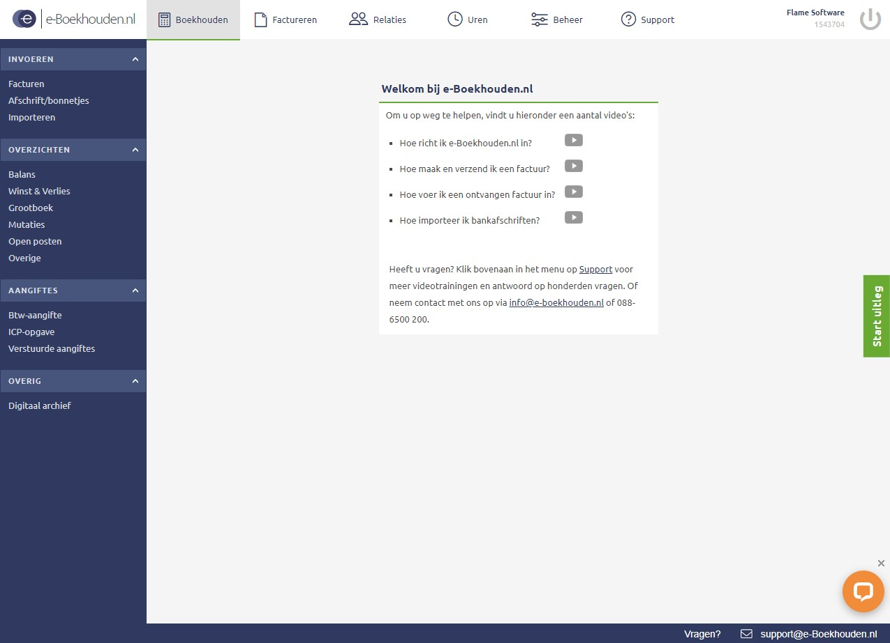

## Liquidity budget 

At the moment we have no monthly expenses. But we also have no income. The only expance that we have made is the E-herkenning. This is needed for taxes.

|     Expence             |   In € |
|-------------------------|--------|
|     E-herkenning        |  66,55 |
|     Total               |  66,55 |

## Accounting 

For our accounting we use e-boekhouden. When we opend an bank account at the ING we got this as an gift. With this programm we can keep track of our transactions. This all will happen automaticly because eboekhouden is linked with our bank acount. In eboekhouden we can also make invoices. There we will keep them organized. At the moment there is not a lot to keep track of because we have nog finances yet.

## What do we need? 

As Flame we need to have a big user base to be profitable. How do we get an big user base? With many users! That is what we ask of you, will you spread the Flame?🔥

## Why would you invest? 

But why will you spread the Flame? If you think the internet is not distribute fairly and you want to see an change. If you want to customize your social media more then you can do now. Or if you are a devoleper who wants to create his/hers own chat platform on our protocol. Then Flame is the right solution for you!

