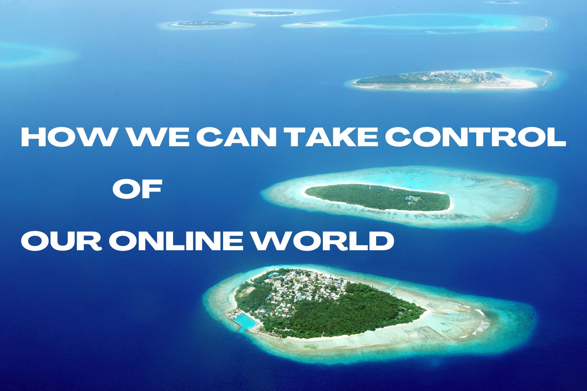

```js
NOTE:
! This whitepaper is not finished.
! Current revision: 0.2
```



# Introduction <a name="{sections[0]}"></a>

In the modern times we are used to subpar experiences online. Stuff that doesn't work well together, or doesn't even work at all. Everyone is building their own wheel, wouldn't it make way more sense to have a blueprint? That is what our paper aims to look at, present the market, the problem, and then the best solution to it and how it might be done in the real world.

---

# Analysing the playing field

Before we can formulate our market issue we must first make clear what our market is and what is the current state of things. We will be discussing a brief history of internet communications, exploring certain influential technologies and standards that will form a basis for our knowledge in the rest of the paper. Then we will look at the currently dominating platforms and categorise them.

## Define the market

Whenever we talk about "communication on the internet", "online communication" or similar in this paper, we are referring to:
- Any way or form for one human being to communicate information towards the internet with the intent for other humans to read it and/or interact with it anywhere on the globe, in a way that is sufficiently user friendly that it can be reasonably executed by anyone, technical or non technical.

This definition includes things such as:
- Real time chatting and chatrooms in applications like Discord, Whatsapp, Telegram and Signal.
- Traditional posts on platforms like Twitter, Facebook and Instagram.
- Long and short form videos or reels on places like TikTok, YouTube and Instagram.
- Blogging on places like Blogger, Wordpress or similar.
- Forums and bulletin boards.
- Image and video galleries
- Live streaming like on Twitch.
- News feeds.

And the list goes on and on.

What is it **not**?
- Raw requests according to standards like REST, WebSockets, etc.
- Platforms not primarily designed to be used by humans such as blockchain technologies.
- Note keeping applications like Google Keep and Notion.

## Brief history of internet communication

Web 1.0 RSS

Web 2.0 IRC, Email

Web 2.0 Skype, then Discord

Web 3.0 Decentralized

Step back to Web 2.0, 3 not needed

Inspired from: RuneScape and similar structures


## Current state of human communication on the internet

Boiled down to its basic components, there are three primary types of places that are used to communicate on the internet:
- A social media, a platform where people can share stuff, usually publicly.
- A chat platform, a place where people can communicate between smaller groups of people, usually in real time.
- An informational site, a place usually of smaller scale primarily meant to be used to collect information of any kind, usually only meant to be edited by a limited group of people.

We should identify some of the industry's current platforms into our categories:
- Twitter, a social media, content is mostly public and generally not real time.
- Facebook, a social media, all sorts of public content.
- Meta Messenger, the primary goal is to send real time messages between users.
- Traditional forums, a social media, data is usually not shared real time and is focused on providing information publicly.
- Personal blogs and galleries, an informational site.
- Twitch, a social media and chat platform, streams behave like posts on social medias and content is mostly public to anyone, but the live chat during streams has many similar characteristics to a chatroom.
- Discord, a chat platform and social media, data can be shared in servers with millions of users, but is generally focused at smaller real time communication.

Let's look briefly at the flow of how these social medias often work for a user:
- A user registers onto the platform and shares details about them to that platform like an email address or name, and requires a password be given to that platform for authorising.
- When authorised, users may perform actions on the platform, such as view or make posts, comment, like, or whatever else the platform features.
- The platform mostly acts independently and has differing featuresets. Twitter focuses on short strips of content, Instagram mostly does photo or video content, Facebook tries a mix of all of it.

---

## Identifying the problem <a name="{sections[3]}"></a>

Currently the industry has 3 major problems for customers:
- They are static and inversatile, places like Discord do this better but comes with its own tradeoffs.
- Everything is either a social media OR a chat app, and both get used around with the other creating friction.
- Moving providers kills your connection with all of your contacts on a platform, adding group pressure and preventing innovation in new platforms.

There are a multitude of second tier problems as well, some of which mentioned below:
- Privacy concerns.
- Data is not forever, can be deleted or lost on bankruptcy or according to GDPR compliance rules.

We won't zoom into these problems in this paper, as we consider to be widely covered and understood and less important to customers than our initial points.

These are the ups and downs for each platform:


## Possible solutions

---

# Introducing the Human Communication Protocol <a name="{sections[4]}"></a>

By creating a connected network, Flame accidentally fixed everything (that it can).

---

## A connected network <a name="{sections[5]}"></a>

## A powerful network <a name="{sections[6]}"></a>

## How does it work in practise?

## Using Translation Servers

### How to maintain encryption

---

# How to keep it alive

## Possible business ventures

## Market value of comparable revenue streams

## Potential pitfalls

## Environmental concerns


---

# Why it hasn't been done before


---

# Conclusion <a name="{sections[8]}"></a>

